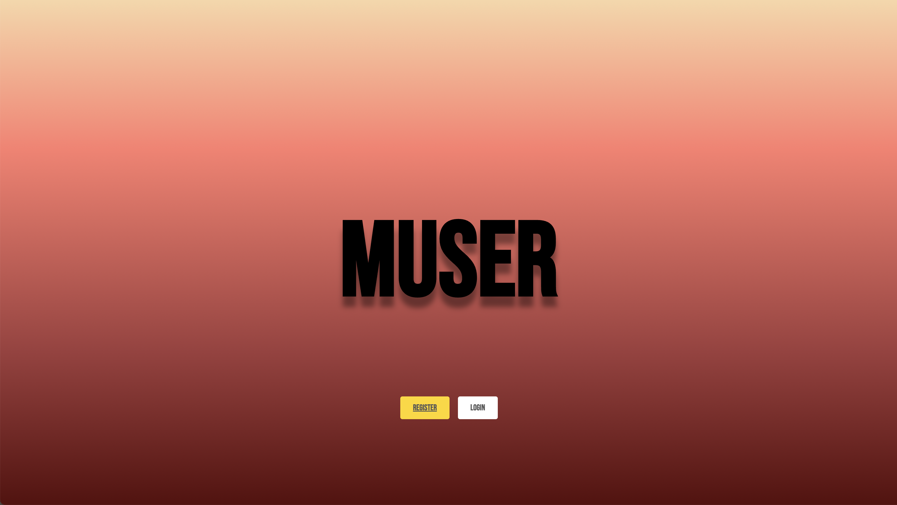

# Muser

Muser is a playlist sharing app that leverages the Spotify API and the Spotify Web Playback SDK. It allows users to register an account, log into Spotify, share playlists with friends, search for songs, and play music within the app. Users can also connect with friends, explore their playlists, and discover popular songs on Muser.



## Technologies

- **Node.js with Express.js:**

  - Node.js: A JavaScript runtime environment for server-side execution.
  - Express.js: A web application framework simplifying backend development.

- **React.js with Vite:**

  - React.js: A JavaScript library for building user interfaces.
  - Vite: A build tool optimizing frontend development and providing instant bundling.

- **Testing with Vitest:**

  - Testing: Ensuring functionality and correctness of the application.
  - Vitest: A build tool supporting various testing frameworks and libraries.

- **Spotify API with Web SDK Playback:**

  - Spotify API: A web service for interacting with Spotify programmatically.
  - Web SDK Playback: A JavaScript library enabling music playback within the web application.

- **OAuth for Authentication:**

  - OAuth: An open standard protocol for secure authorization.

## Installation & Setup

1. **Clone the Repository**

   - Clone the repository to your local environment:
     ```
     git clone https://github.com/JeremyMorkos/Muser
     ```

2. **Install Server Dependencies**

   - Navigate to the server folder:
     ```
     cd Muser/server
     ```
   - Install the server-side dependencies:
     ```
     npm install
     ```

3. **Configure Environment Variables**

   - In the server folder, rename `.env.example` to `.env`.
   - Open `.env` and provide the necessary configurations, such as Spotify API credentials.

4. **Start the Server**

   - Start the server application:
     ```
     npm start
     ```

5. **Install Client Dependencies**

   - Open a new terminal window.
   - Navigate to the client folder:
     ```
     cd Muser/client
     ```
   - Install the client-side dependencies:
     ```
     npm install
     ```

6. **Start the Client Development Server**

   - Start the client development server:
     ```
     npm run dev
     ```

7. **Access the Application**

   - Open your web browser and go to `http://localhost:5173` to access the Muser application.

## User Stories

- **Registration**: As a music enthusiast, I want to register an account on Muser to access personalised features and connect with other users.

- **Spotify Integration**: I want to log into my Spotify account within the app to access my playlists and favorite songs.

- **Song Search**: I want to search for songs available on Spotify to discover new music and add them to my playlists.

- **Playlist Sharing**: I want to share my favorite playlists with friends on the platform to discover and enjoy music together.

- **Explore Friends' Playlists**: I want to explore my friends' playlists and see what songs are popular among them.

- **Music Playback**: I want to play music directly within the app using the Spotify Web Playback SDK for a seamless music listening experience.

## Wireframe 
- https://app.diagrams.net/#G1iIJwBY6uEePwt5w_fXTxJOeaaOUb08vx

## Hurdles / problems
- The main hurdle I have faced through the process of the application was the authentication of the Spotify web sdk, connection was not always stable and sometimes it didn’t connect until refreshing the page or logging in and out. 

